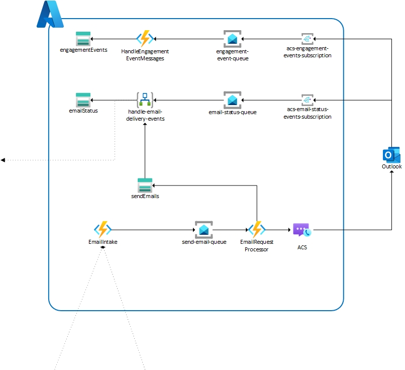

# Azure Communication Services Email

## About

Azure Communication Services Email is capabable of high transactional and bulk email processing that enables Application-to-Person (A2P) use cases.  To demonstrate a subset of ACSE capabilities we will utilize the Azure resources listed below to deploy a serverless architecture that is capable of sending emails, tracking their status, and capturing engagements (link clicked).  Data will be persisted in a simple s

- Azure Communicaiton Services Email
- Event Grid System Topic
- Service Bus
- Logic Apps
- Function Apps
- Table Storage

## Architecture

The demo nis focused around a serverless arhictecture that is loosely coupled using Azure Functions, Logic Apps, Service Bus, and Event Grid. The serverless component enables optimal resource allocation by implementing elastic horizontal scaling based on demand. Service Bus ensures we have transactional insight into messages and events, and should there be a processing error we can review messages in the dead-letter queue. Event Grid is responsible for routing system events to the appropriate queue for messaging. ACSE generates two types of system events:

- `Microsoft.Communication.EmailDeliveryReportReceived`
- `Microsoft.Communication.EmailEngagementTrackingReportReceived`

Each message is routed to an appropriate queue based on our subscription.  Once they arrive in their desitnations processing is doing using a FunctionApp or LogicApp -- all depending on the event type. The Event Grid subscriptions will also promote some properties to aid in our routing and processing of events.

Later on in this document we'll walk through editing one our LogicApp Workflow to enable integration with Teams.  We'll use this integration to post message delivery updates.

### System Design

## Setup

To quickly deploy the resources shown in the architecture section we'll exectue our [deployment script for acs](../../scripts/deployments/acs/deployment.ps1). The script does its best to walk you through all the required steps:

- az login
- terraform plan, validate, apply
- function app deploy
- logic app deploy

Upon deployment navigate to your subscription and look for the newly created resource group -- `acs-demo-rg-{random-4-chars}`.  The default deployment region is **East US 2**. You can chagne this by passing the `-location` parameter to the script and setting it your desired location.  

> :globe_with_meridians:
> Azure Communication Services and Event grid will be deployed under the `global` location

To send a test message you can send a `POST` message to the `email-intake` function.  This function is a simple frontend to the queue.  It will take the HTTP request, parse the body, and submit it to the queue.  Once the message has arrived in the queue the `email-request-processor` function will build a message and submit an email for sending to ACS.  The interaction with ACS is done through the ACS sdk nuget package [Azure.Communication.Email (1.0.0-beta.1)](https://www.nuget.org/packages/Azure.Communication.Email). Detailed instrutions how to use the SDK can be found on the packages nuget site.
